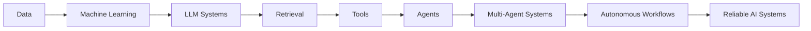
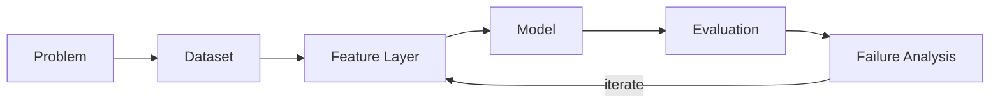
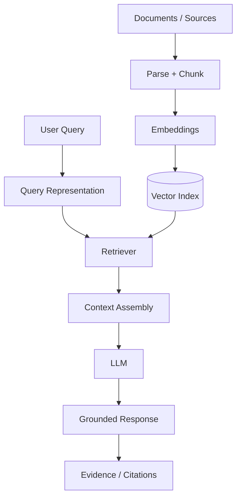
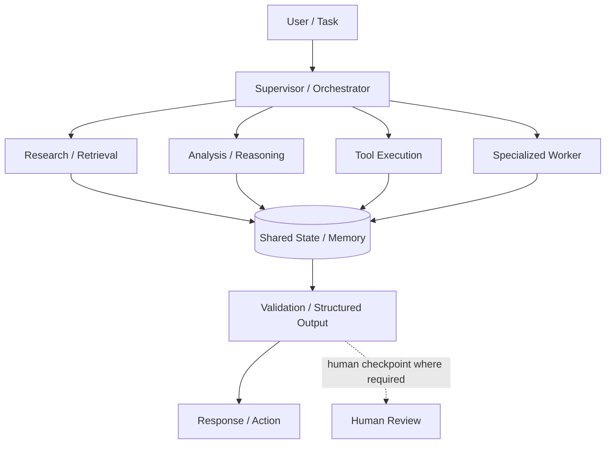
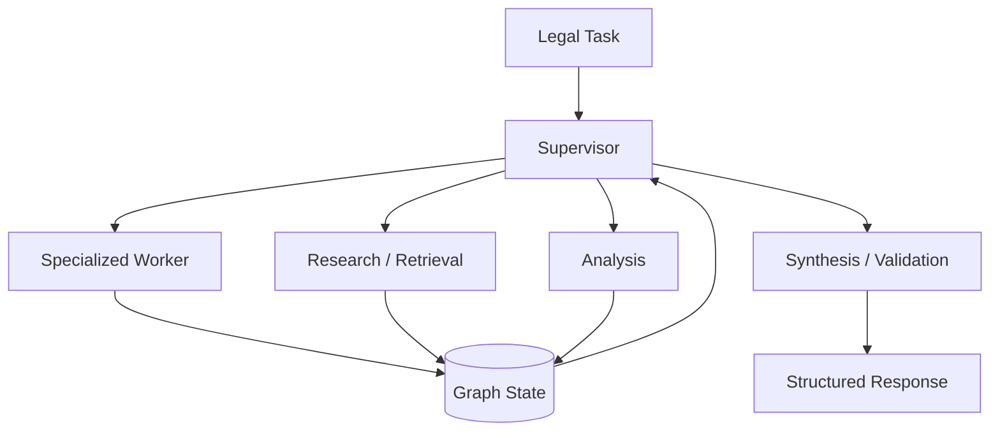
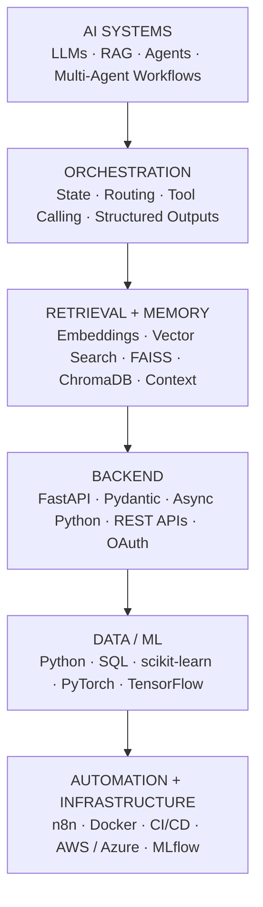
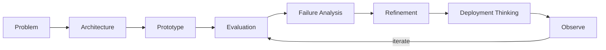

<!--
╔══════════════════════════════════════════════════════════════════════╗
║                    YASHVI // AI ENGINEER OS                         ║
║ GitHub-native application-style profile README                     ║
║ Priority: Evidence > Architecture > Clarity > Story > Visuals       ║
╚══════════════════════════════════════════════════════════════════════╝

MAINTENANCE:
- Keep this file GitHub-native: Markdown + supported HTML + Mermaid + SVG.
- Do not add fake metrics, fake production claims, or unsupported architecture.
- Replace repo search links with direct repository URLs when final slugs are fixed.
-->

<p align="center">
  
</p>

<p align="center">
  <a href="https://www.yashviivekariya.site/"><b>Portfolio</b></a>
  &nbsp;·&nbsp;
  <a href="http://yashvi-ai-engineer-mvdc7u9.gamma.site/"><b>Portfolio II</b></a>
  &nbsp;·&nbsp;
  <a href="https://www.linkedin.com/in/yashvi-vekariya/"><b>LinkedIn</b></a>
  &nbsp;·&nbsp;
  <a href="mailto:vyashvi304@gmail.com"><b>Email</b></a>
</p>

---

<table>
<tr>
<td width="68%" valign="top">

## `AI_ENGINEER_OS // HOME`

I build AI systems that move beyond isolated model calls—combining **retrieval, memory, tools, orchestration, structured interfaces, automation, evaluation, and backend systems** into software that can reason, act, and improve.

```text
INPUT
  ↓
DATA
  ↓
MODELS
  ↓
CONTEXT
  ↓
TOOLS
  ↓
AGENTS
  ↓
ORCHESTRATION
  ↓
EVALUATION
  ↓
SYSTEMS
```

</td>
<td width="32%" valign="top">

### `SYSTEM STATUS`

| Signal | State |
|---|---|
| **Role** | AI Systems Engineer |
| **Focus** | Agentic AI / LLM Systems |
| **Mode** | Build → Evaluate → Refine |
| **Bias** | Architecture > Buzzwords |
| **North Star** | Reliable intelligent software |

</td>
</tr>
</table>

---

## `NAVIGATION // MODULES`

<table>
<tr>
<td align="center"><a href="#01--system-boot"><b>01<br/>BOOT</b></a></td>
<td align="center"><a href="#02--signal-layer"><b>02<br/>SIGNALS</b></a></td>
<td align="center"><a href="#03--model-layer"><b>03<br/>MODELS</b></a></td>
<td align="center"><a href="#04--context-layer"><b>04<br/>CONTEXT</b></a></td>
<td align="center"><a href="#05--tool-layer"><b>05<br/>TOOLS</b></a></td>
<td align="center"><a href="#06--agent-layer"><b>06<br/>AGENTS</b></a></td>
<td align="center"><a href="#07--systems-layer"><b>07<br/>SYSTEMS</b></a></td>
<td align="center"><a href="#08--constellation"><b>08<br/>PROJECTS</b></a></td>
<td align="center"><a href="#09--engineering-dna"><b>09<br/>DNA</b></a></td>
</tr>
</table>

---

# `01 // SYSTEM BOOT`

> **What happens when data stops being something we only analyze—and starts becoming something software can reason over, retrieve from, act on, and coordinate around?**

That question became the thread connecting my work.



### `ENGINEERING IDENTITY`

```text
problem definition
      ↓
system architecture
      ↓
data / retrieval
      ↓
model integration
      ↓
agent orchestration
      ↓
tool integration
      ↓
API / backend
      ↓
evaluation
      ↓
observability
      ↓
deployment thinking
```

---

# `02 // SIGNAL LAYER`

<table>
<tr>
<td width="56%" valign="top">

### `RAW SIGNALS`

> **I started by learning how systems understand the world: through data.**

Before agents and orchestration came the foundation:

- Python
- SQL
- data analysis
- feature engineering
- predictive modeling
- experimentation
- evaluation

The important lesson was simple:

**good intelligence begins with good problem framing and measurable signals.**

</td>
<td width="44%" valign="top">

### `SYSTEM TRACE`

**Mutual Fund Predictive Analytics**

`Problem`  
Extract useful predictive structure from financial data.

`Pipeline`  
Data → features → model → evaluation → interpretation.

`What it proves`  
A data / ML foundation underneath later AI-system work.

</td>
</tr>
</table>

---

# `03 // MODEL LAYER`

> **Analyzing data was useful. Predicting from it was better.**



<table>
<tr>
<td width="33%" valign="top">

### `LEARN`

Pattern discovery, prediction, representation.

</td>
<td width="33%" valign="top">

### `MEASURE`

Metrics, error analysis, comparison, validation.

</td>
<td width="33%" valign="top">

### `REFINE`

Features, model choice, thresholds, workflow design.

</td>
</tr>
</table>

**Representative technologies:** `scikit-learn` · `PyTorch` · `TensorFlow` · `Python` · `SQL`

---

# `04 // CONTEXT LAYER`

> **Models know patterns. Useful systems also need context.**

<div align="center">

### `RAG PIPELINE // DOCUMENT → GROUNDED OUTPUT`

</div>



<table>
<tr>
<td width="50%" valign="top">

### `AUTONOMOUS RESEARCH AGENT`

Grounded research workflow focused on source-aware information gathering, structured synthesis, and autonomous task coordination.

**Signals:** retrieval · web grounding · structured synthesis · citations

</td>
<td width="50%" valign="top">

### `NEURON DOC`

Document-intelligence / RAG direction centered on converting unstructured information into usable model context.

**Signals:** chunking · embeddings · vector search · retrieval

</td>
</tr>
</table>

---

# `05 // TOOL LAYER`

> **Context made models informed. Tools made them capable.**

```text
                    ┌───────────────┐
                    │  LLM / AGENT  │
                    └───────┬───────┘
                            │
          ┌─────────────────┼─────────────────┐
          │                 │                 │
       SEARCH              APIs             MEMORY
          │                 │                 │
          └──────────┬──────┴──────┬──────────┘
                     │             │
                AUTOMATION     STRUCTURED
                                OUTPUTS
                     │             │
                     └──────┬──────┘
                            │
                    EXTERNAL SYSTEMS
```

<table>
<tr>
<td width="33%" valign="top">

### `AetherMind`

Enterprise-intelligence direction combining **memory** with productivity-style integrations and tool-mediated workflows.

</td>
<td width="33%" valign="top">

### `YouTube Automation`

n8n-based AI automation pipeline for content-generation and publishing workflows.

</td>
<td width="33%" valign="top">

### `Research Agent`

Research orchestration with external information access and structured synthesis.

</td>
</tr>
</table>

`tool calling` · `REST APIs` · `OAuth` · `automation` · `external integrations` · `structured outputs`

---

# `06 // AGENT LAYER`

<div align="center">

## `FROM ONE MODEL → COORDINATED INTELLIGENCE`

</div>

> **One intelligent component can solve a task. A coordinated system can solve a workflow.**



> Repository-specific READMEs should only claim nodes that are actually implemented.

<table>
<tr>
<td width="33%" valign="top">

### `ARBITER`

Autonomous multi-agent legal AI using **LangGraph** and a **supervisor-worker architecture**.

**Focus:** graph orchestration · specialized agents · shared state

</td>
<td width="33%" valign="top">

### `AgentForge OS`

Agent-engineering platform direction combining orchestration with **LoRA / fine-tuning, MLflow, logs, evaluation, and AI infrastructure concepts**.

</td>
<td width="33%" valign="top">

### `AetherMind`

Memory-aware enterprise AI direction combining intelligent workflows with external-system integrations.

</td>
</tr>
</table>

### `AGENT MATURITY CHECKLIST`

```text
[✓] responsibility boundaries
[✓] routing
[✓] explicit state
[✓] tools
[✓] structured outputs
[~] evaluation
[~] observability
[~] human checkpoints
[→] long-running reliability
```

`✓ implemented where repository evidence supports it`  
`~ active engineering focus`  
`→ next-stage system capability`

---

# `07 // SYSTEMS LAYER`

<div align="center">

# `SYSTEMS > DEMOS`

**A demo proves an idea can work. Engineering asks whether it can keep working.**

</div>

<table>
<tr>
<td width="50%" valign="top">

### `INTELLIGENCE PLANE`

```text
Models
Retrieval
Memory
Tools
Planning / Routing
Structured Outputs
```

</td>
<td width="50%" valign="top">

### `ENGINEERING PLANE`

```text
Evaluation
Observability
Typed Interfaces
Failure Handling
Testing
Security
Latency
Cost
Human Oversight
```

</td>
</tr>
</table>

### `PRODUCTION THINKING MATRIX`

| Layer | Engineering question |
|---|---|
| **Evaluation** | Did behavior improve—or merely change? |
| **Reliability** | What happens when a model, tool, API, or retriever fails? |
| **Observability** | Can we inspect what the system did? |
| **Interfaces** | Are state, inputs, outputs, and tool contracts explicit? |
| **Testing** | Which components can be tested deterministically? |
| **Security** | What can the system access, expose, or execute? |
| **Latency** | Which stage dominates end-to-end response time? |
| **Cost** | Where are model calls, tokens, or retrieval operations wasted? |
| **Oversight** | Which actions should remain approval-gated? |
| **Maintainability** | Can one layer change without destabilizing the system? |

---

# `08 // CONSTELLATION`

<div align="center">

## `SYSTEM CONSTELLATION`

**Projects grouped by what they prove—not by how many repositories exist.**

</div>

### `AGENT SYSTEMS`

<table>
<tr>
<td width="33%" valign="top">

#### `ARBITER`

**Mission**  
Multi-agent legal intelligence.

**Architecture**  
Supervisor-worker / graph orchestration.

**Engineering signal**  
Responsibility decomposition, routing, state.

**Stack**  
`LangGraph` · `Python` · `LLMs`

[Repository →](https://github.com/Yashvi-Vekariya?tab=repositories&q=ARBITER)

</td>
<td width="33%" valign="top">

#### `AgentForge OS`

**Mission**  
Agent engineering + AI infrastructure.

**Architecture**  
Agent platform / evaluation / ML infrastructure direction.

**Engineering signal**  
Orchestration, LoRA, MLflow, logs.

**Stack**  
`Python` · `MLflow` · `LoRA`

[Repository →](https://github.com/Yashvi-Vekariya?tab=repositories&q=AgentForge)

</td>
<td width="33%" valign="top">

#### `AetherMind`

**Mission**  
Memory-aware enterprise intelligence.

**Architecture**  
Agent + memory + external tools.

**Engineering signal**  
Integrations, state, action-oriented AI.

**Stack**  
`Python` · `LLMs` · `APIs`

[Repository →](https://github.com/Yashvi-Vekariya?tab=repositories&q=AetherMind)

</td>
</tr>
</table>

### `RETRIEVAL / RESEARCH`

<table>
<tr>
<td width="50%" valign="top">

#### `Autonomous Research Agent`

**Mission**  
Grounded autonomous research.

**Architecture**  
Research orchestration + retrieval + synthesis.

**Engineering signal**  
Source grounding and structured research workflows.

[Repository →](https://github.com/Yashvi-Vekariya?tab=repositories&q=research)

</td>
<td width="50%" valign="top">

#### `Neuron Doc`

**Mission**  
Turn documents into usable model context.

**Architecture**  
RAG / document intelligence.

**Engineering signal**  
Chunking, embeddings, vector search, retrieval.

</td>
</tr>
</table>

### `APPLIED INTELLIGENCE`

<table>
<tr>
<td width="33%" valign="top">

#### `DeutschMentor AI`

Speech / text AI for a production-shaped language-learning experience.

[Repository →](https://github.com/Yashvi-Vekariya?tab=repositories&q=DeutschMentor)

</td>
<td width="33%" valign="top">

#### `SkillSphere OS`

AI-native workforce intelligence and verifiable-skill infrastructure direction.

[Repository →](https://github.com/Yashvi-Vekariya?tab=repositories&q=SkillSphere)

</td>
<td width="33%" valign="top">

#### `AEGIS`

AI-powered burnout detection and intervention workflow.

[Repository →](https://github.com/Yashvi-Vekariya?tab=repositories&q=AEGIS)

</td>
</tr>
</table>

---

# `THE SYSTEM I WOULD SHOW FIRST // ARBITER`

<table>
<tr>
<td width="62%" valign="top">

### `WHY THIS SYSTEM`

Legal-intelligence workflows are a useful stress test for agent architecture because they require **task decomposition, context handling, disciplined intermediate reasoning, and structured synthesis**.

### `ENGINEERING CHALLENGE`

The hard part is not creating more agents.

It is defining:

- responsibility boundaries
- routing logic
- shared state
- tool boundaries
- output contracts
- validation points

so coordination adds value instead of complexity.

</td>
<td width="38%" valign="top">

### `SYSTEM CARD`

**Type**  
Multi-Agent AI

**Pattern**  
Supervisor → workers

**Core idea**  
Graph-based orchestration

**Focus**  
State · routing · synthesis

**Repository**  
[Open ARBITER →](https://github.com/Yashvi-Vekariya?tab=repositories&q=ARBITER)

</td>
</tr>
</table>



> **What this project taught me:** multi-agent design is primarily a systems-design problem. Coordination quality matters more than agent count.

---

# `09 // ENGINEERING DNA`

<div align="center">

## `STACK AS SYSTEM LAYERS`

</div>



### `DURABLE CONCEPTS > FRAMEWORK IDENTITY`

Frameworks change.

The system problems stay:

`orchestration` · `retrieval` · `evaluation` · `model abstraction` · `memory` · `context engineering` · `tool interfaces` · `APIs` · `observability` · `security` · `cost-performance tradeoffs` · `human-agent interaction`

---

# `10 // BUILD LOOP`



<div align="center">

**DEFINE → ARCHITECT → BUILD → MEASURE → INSPECT FAILURES → REFINE → OPERATE**

</div>

---

# `11 // LIVE FOCUS`

<table>
<tr>
<td width="25%" valign="top">

### `01`
**Reliable agent orchestration**

State, routing, contracts, failure paths.

</td>
<td width="25%" valign="top">

### `02`
**Agent evaluation**

Trajectories, tool use, output validity, task completion.

</td>
<td width="25%" valign="top">

### `03`
**Context + memory**

Relevant information without uncontrolled context growth.

</td>
<td width="25%" valign="top">

### `04`
**AI observability**

Make multi-step behavior easier to inspect and improve.

</td>
</tr>
</table>

---

# `12 // NEXT SYSTEMS`

> These are **exploration directions**, not claims of completed expertise.

| State | Direction | System question |
|---|---|---|
| `EXPLORING` | Model routing | Which model should handle which task, at what latency / cost? |
| `EXPLORING` | Multimodal agents | How should systems coordinate text, vision, audio, and tools? |
| `NEXT` | Long-running workflows | How should state survive retries, checkpoints, and resumptions? |
| `NEXT` | AI security | How should tool permissions, prompt injection, and data boundaries be controlled? |
| `NEXT` | LLMOps / inference optimization | How can model serving become cheaper, faster, and more observable? |
| `NEXT` | Human-agent collaboration | Where should automation stop and human judgment begin? |

---

<details>
<summary><strong>⌘ open developer console // inspect_system()</strong></summary>

<br/>

```text
SYSTEM PRINCIPLES
────────────────────────────────────────
01  Evidence > adjectives
02  Architecture > buzzwords
03  Explicit state > invisible behavior
04  Structured interfaces > fragile handoffs
05  Evaluation > "it feels better"
06  Reliability > demo magic
07  Fewer deep systems > dozens of equal projects
```

### `PROBLEMS I LIKE`

- How should responsibilities be split across agents?
- When should a system retrieve, call a tool, ask a human, or stop?
- What belongs in memory vs retrieval vs transient state?
- How do we make agent trajectories observable and testable?
- How do we keep AI useful when a dependency fails?
- Which steps need an LLM—and which steps should remain deterministic?

### `CURRENT EXPERIMENT DIRECTION`

Architecture-first AI systems combining:

`retrieval` + `tools` + `explicit state` + `evaluation` + `backend interfaces` + `observable workflows`

</details>

---

# `13 // EVIDENCE MODE`

```text
NO FAKE METRICS
NO FAKE "PRODUCTION" CLAIMS
NO FAKE BENCHMARKS
NO FAKE POPULARITY
```

Where a repository contains a measured result, I document it with its evaluation context.

Where measurement has not yet been completed, I prefer to expose the **evaluation design** rather than an unsupported number.

### `METRICS I WANT MATURE SYSTEMS TO REPORT`

<table>
<tr>
<td>Task completion rate</td>
<td>Structured-output validity</td>
<td>Tool success rate</td>
</tr>
<tr>
<td>Retrieval precision / recall</td>
<td>Faithfulness / context relevance</td>
<td>Latency / failure rate</td>
</tr>
<tr>
<td>Token usage</td>
<td>Cost per task</td>
<td>Trajectory quality</td>
</tr>
</table>

---

# `14 // REUSABLE COMPONENT`

<!--
COPY/PASTE THIS BLOCK FOR A NEW PROJECT.
Change:
- system name
- mission
- architecture
- engineering problem
- stack
- repository URL
-->

<table>
<tr>
<td width="50%" valign="top">

### `SYSTEM_NAME`

**Mission**  
One sentence describing the real problem.

**Architecture**  
`Agent / RAG / ML / Automation / API`

</td>
<td width="50%" valign="top">

**Interesting engineering problem**  
One sentence about the non-trivial technical challenge.

**Stack**  
`Tech 1` · `Tech 2` · `Tech 3` · `Tech 4`

**Repository**  
[Open system →](https://github.com/Yashvi-Vekariya)

</td>
</tr>
</table>

---

# `15 // FINAL NODE`

```text
DATA
  ↓
MODELS
  ↓
CONTEXT
  ↓
TOOLS
  ↓
AGENTS
  ↓
ORCHESTRATION
  ↓
EVALUATION
  ↓
RELIABLE AI SYSTEMS
```

I am less interested in making AI **appear** intelligent.

I am more interested in the engineering required to make intelligent behavior:

**useful · inspectable · measurable · maintainable**

---

<p align="center">

### `SYSTEM LINKS`

<a href="https://www.yashviivekariya.site/">Portfolio</a>
&nbsp;·&nbsp;
<a href="http://yashvi-ai-engineer-mvdc7u9.gamma.site/">Portfolio II</a>
&nbsp;·&nbsp;
<a href="https://www.linkedin.com/in/yashvi-vekariya/">LinkedIn</a>
&nbsp;·&nbsp;
<a href="https://github.com/Yashvi-Vekariya">GitHub</a>
&nbsp;·&nbsp;
<a href="mailto:vyashvi304@gmail.com">Email</a>

<br/><br/>

**BUILDING THE LAYERS THAT TURN MODELS INTO SYSTEMS.**

</p>
