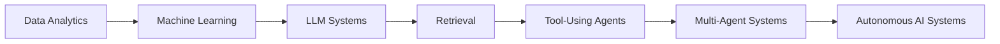
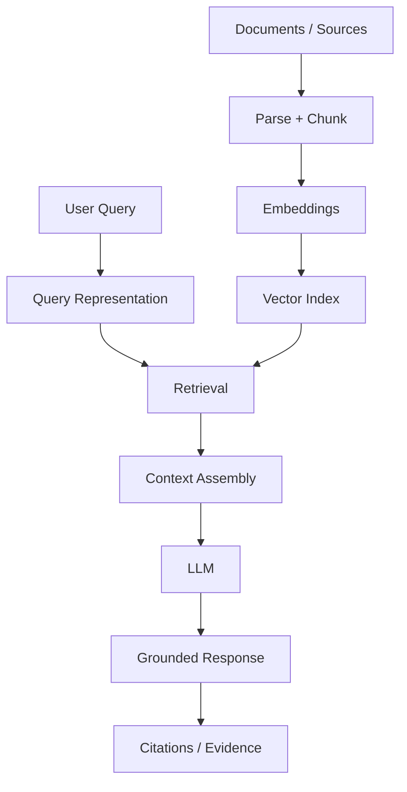
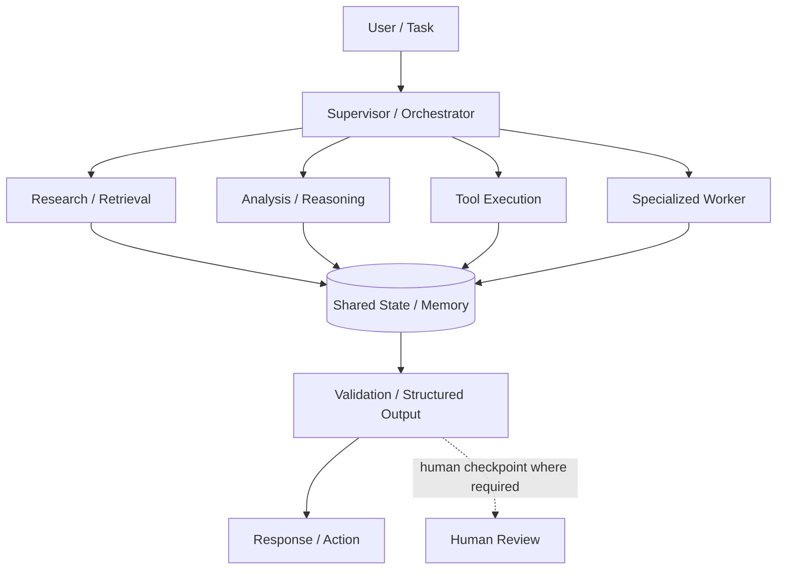
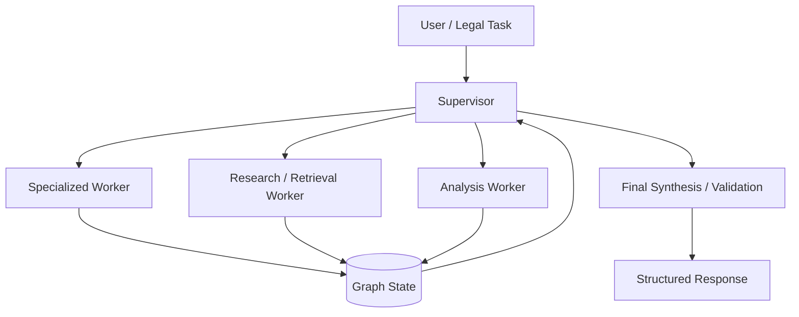
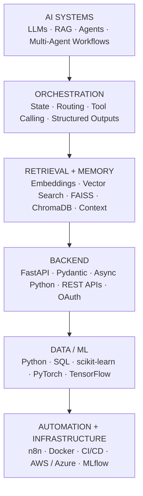
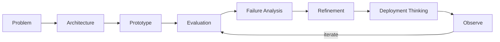

<!--
  YASHVI VEKARIYA — GitHub Profile README
  Design principle:
  Technical evidence > Architecture > Clarity > Story > Visual design

  EDITING NOTES
  - Keep major copy directly in this file.
  - Prefer Mermaid for diagrams.
  - Replace repository URLs if project slugs change.
  - Never add metrics unless you have measured evidence.
-->

<div align="center">

# YASHVI VEKARIYA

### AI SYSTEMS ENGINEER

**Data → Models → Context → Agents → Autonomous Systems**

I engineer AI systems that move beyond isolated model calls—combining retrieval, memory, tools, orchestration, structured interfaces, evaluation, automation, and backend systems into software that can reason, act, and be improved.

`STATUS  Building` &nbsp;&nbsp; `FOCUS  Agentic AI / LLM Systems` &nbsp;&nbsp; `MODE  Architecture → Evaluation → Deployment`

[Portfolio](https://www.yashviivekariya.site/) ·
[Portfolio II](http://yashvi-ai-engineer-mvdc7u9.gamma.site/) ·
[LinkedIn](https://www.linkedin.com/in/yashvi-vekariya/) ·
[GitHub](https://github.com/Yashvi-Vekariya) ·
[Email](mailto:vyashvi304@gmail.com)

</div>

---

## CHAPTER 00 / SYSTEM BOOT

My journey started with a simple question:

> **What happens when data stops being something we only analyze—and starts becoming something systems can reason over, retrieve from, act on, and coordinate around?**

That question gradually changed the kind of systems I wanted to build.



The progression matters more to me than any single framework.

I am interested in the full engineering path:

**problem definition → architecture → data / context → model integration → orchestration → tools → APIs → evaluation → observability → deployment thinking**

---

## CHAPTER 01 / RAW SIGNALS

> **I started by learning how systems understand the world: through data.**

Before agents, orchestration, or retrieval, there is a more basic engineering problem: extracting signal from imperfect inputs.

That foundation shaped how I approach AI systems today—define the problem, structure the data, measure behavior, and avoid confusing a compelling demo with reliable evidence.

### SYSTEM TRACE / MUTUAL FUND PREDICTIVE ANALYTICS

| Layer | Evidence |
|---|---|
| **Mission** | Explore financial data through predictive analytics and ML workflows. |
| **Signal extracted** | Patterns useful for prediction, comparison, and decision-support analysis. |
| **Engineering concept** | Data preparation → feature work → modeling → evaluation → interpretable outputs. |
| **What it represents** | My data / ML foundation before moving deeper into LLM systems. |

**Foundation:** Python · SQL · data analysis · feature engineering · predictive modeling · experimentation

---

## CHAPTER 02 / TEACHING MACHINES

> **Analyzing data was useful. Predicting from it was better.**

This stage moved my work from describing historical signals toward building systems that learn patterns and produce predictions.

Instead of treating ML as a list of libraries, I think about the pipeline:


The important part is not only training a model. It is understanding:

**what the target means · how the data is shaped · how the model fails · which metric matters · whether the result is actually useful**

Technologies appearing across this layer of my work include **scikit-learn, PyTorch, TensorFlow, Python, SQL, and evaluation workflows**.

---

## CHAPTER 03 / GIVING MODELS CONTEXT

> **Models know patterns. Useful systems also need context.**

LLMs became more interesting to me when I stopped treating the prompt as the entire system.

Retrieval introduced a different engineering problem: how to select, structure, rank, and pass the right information to a model at the right time.



### SYSTEMS IN THIS CHAPTER

**Autonomous Research Agent with Web Grounding**  
Grounded research workflow focused on gathering information, coordinating research tasks, and producing structured synthesis with source-aware reasoning.

**Neuron Doc**  
Document-intelligence / retrieval direction centered on turning unstructured documents into useful model context.

This stage pushed me deeper into:

`retrieval` · `embeddings` · `vector search` · `context management` · `grounding` · `citations` · `RAG`

---

## CHAPTER 04 / GIVING AI TOOLS

> **Context made models informed. Tools made them capable.**

Once an LLM can retrieve information, the next question is whether it can interact with the systems around it.

```text
LLM / AGENT
│
├── Search
├── APIs
├── Memory
├── Structured Outputs
├── Automation
└── External Systems
```

That changes the system from:

**“generate an answer”**

into:

**“decide what to do, use a capability, observe the result, update state, and continue.”**

### SYSTEMS IN THIS CHAPTER

**AetherMind**  
Autonomous enterprise-intelligence direction combining memory with productivity-style integrations and tool-mediated workflows.

**AI YouTube Automation**  
n8n-based AI automation pipeline for orchestrating content-generation and publishing steps.

**Autonomous Research Agent**  
Research orchestration with external information access, structured synthesis, and grounded output.

Engineering themes:

**tool calling · REST APIs · OAuth · automation · external integrations · structured outputs · stateful workflows**

---

## CHAPTER 05 / FROM ONE MODEL TO MANY AGENTS

> **One intelligent component can solve a task. A coordinated system can solve a workflow.**

This is the layer I am most interested in: moving from single-call applications toward systems in which responsibilities are separated, state is explicit, tools are controlled, and multiple components cooperate around a larger objective.



> The diagram above represents the orchestration pattern I work toward. Repository-specific READMEs should document only the nodes actually implemented in each system.

### SYSTEMS IN THIS CHAPTER

**ARBITER**  
Autonomous multi-agent legal AI built around a **LangGraph supervisor-worker architecture**.

**AgentForge OS**  
Agent-engineering platform direction combining orchestration with fine-tuning / LoRA, MLflow, logging, evaluation, and infrastructure-oriented concepts.

**AetherMind**  
Enterprise-oriented intelligent system with memory and external integrations.

Across agent systems, the concepts I care about are:

**routing · specialized responsibilities · explicit state · memory · tool execution · structured responses · validation · human checkpoints where appropriate**

---

## CHAPTER 06 / SYSTEMS > DEMOS

# SYSTEMS > DEMOS

> **An AI demo proves an idea can work. Engineering asks whether it can keep working, fail clearly, and improve safely.**

The model is only one layer.

```text
AI SYSTEM
│
├── Intelligence
├── Context / Retrieval
├── Orchestration
├── Tools / Integrations
├── Memory / State
├── Typed Interfaces
├── Evaluation
├── Observability
├── Failure Handling
└── Infrastructure
```

### ENGINEERING QUESTIONS I CARE ABOUT

| Dimension | Question |
|---|---|
| **Evaluation** | How do we know the system is improving rather than merely changing? |
| **Reliability** | What happens when a model, API, retriever, or tool fails? |
| **Observability** | Can we understand what the system did and why? |
| **Typed interfaces** | Are inputs, outputs, state, and tool contracts explicit? |
| **Testing** | Which deterministic components can be tested independently? |
| **Security** | What can the system access, execute, expose, or trust? |
| **Latency** | Which step dominates the user-perceived response time? |
| **Cost** | Where are tokens, model calls, retrieval, or infrastructure wasted? |
| **Human oversight** | Which decisions should remain reviewable or approval-gated? |
| **Maintainability** | Can a future engineer change one layer without breaking every other layer? |

I do not present these as claims that every repository has solved every dimension. They are the standard I use to decide what a serious AI system still needs.

---

# SYSTEM CONSTELLATION

Not every repository needs equal attention. These are the systems that best explain the engineering direction of my GitHub.

### AGENT SYSTEMS

| System | What it demonstrates |
|---|---|
| **[ARBITER](https://github.com/Yashvi-Vekariya?tab=repositories&q=ARBITER)** | Multi-agent legal intelligence, supervisor-worker orchestration, graph-based coordination. |
| **[AgentForge OS](https://github.com/Yashvi-Vekariya?tab=repositories&q=AgentForge)** | Agent engineering, AI infrastructure concepts, fine-tuning / LoRA, MLflow, logging, evaluation direction. |
| **[AetherMind](https://github.com/Yashvi-Vekariya?tab=repositories&q=AetherMind)** | Memory-aware enterprise intelligence with external integrations. |

### RETRIEVAL + RESEARCH

| System | What it demonstrates |
|---|---|
| **[Autonomous Research Agent with Web Grounding](https://github.com/Yashvi-Vekariya?tab=repositories&q=research)** | Autonomous research, web grounding, structured synthesis, source-aware workflows. |
| **Neuron Doc** | Document intelligence and RAG-oriented context engineering. |

### APPLIED AI SYSTEMS

| System | What it demonstrates |
|---|---|
| **[DeutschMentor AI](https://github.com/Yashvi-Vekariya?tab=repositories&q=DeutschMentor)** | Speech / text AI applied to a production-shaped language-learning experience. |
| **[SkillSphere OS](https://github.com/Yashvi-Vekariya?tab=repositories&q=SkillSphere)** | AI-native workforce intelligence and verifiable-skill infrastructure direction. |
| **[AEGIS](https://github.com/Yashvi-Vekariya?tab=repositories&q=AEGIS)** | AI-powered burnout-detection and intervention workflow. |

### AUTOMATION + ML

| System | What it demonstrates |
|---|---|
| **AI YouTube Automation** | n8n-orchestrated AI content workflow and publishing automation. |
| **Mutual Fund Predictive Analytics** | Data analysis, feature work, predictive modeling, and ML evaluation. |

---

# THE SYSTEM I WOULD SHOW FIRST

## ARBITER

**Mission**  
Explore how a legal-intelligence workflow can be decomposed into coordinated AI responsibilities instead of one oversized prompt.

**Architecture**  
Supervisor-worker multi-agent orchestration using LangGraph, with specialized workflow responsibilities coordinated through graph/state logic.



**Why it matters**  
Legal workflows are a useful stress test for agent architecture because the system needs decomposition, context handling, traceable intermediate work, and disciplined final synthesis.

**Engineering challenge**  
The difficult part is not creating more agents. It is defining **responsibility boundaries, routing logic, shared state, and output contracts** so orchestration adds value instead of complexity.

**What this project taught me**  
Multi-agent design is primarily a systems-design problem: coordination quality matters more than agent count.

**Repository**  
→ [Find ARBITER on my GitHub](https://github.com/Yashvi-Vekariya?tab=repositories&q=ARBITER)

---

# REUSABLE SYSTEM CARD

<!--
Copy this block to add a new system.
Change only:
1. Name
2. Mission
3. Architecture
4. Engineering problem
5. Stack
6. Repository URL
-->

<table>
<tr>
<td width="50%" valign="top">

### `SYSTEM_NAME`

**Mission**  
One sentence describing the real problem.

**Architecture**  
`Agent / RAG / ML / Automation / API`

</td>
<td width="50%" valign="top">

**Interesting engineering problem**  
One sentence about the non-trivial technical problem.

**Stack**  
`Tech 1` · `Tech 2` · `Tech 3` · `Tech 4`

**Repository**  
[Open system →](https://github.com/Yashvi-Vekariya)

</td>
</tr>
</table>

---

# ENGINEERING DNA

I prefer describing my stack as system layers rather than as a logo wall.



### DURABLE CONCEPTS > FRAMEWORK IDENTITY

Frameworks will change.

The engineering problems remain:

**orchestration · retrieval · evaluation · model abstraction · data pipelines · memory · context engineering · tool interfaces · APIs · observability · security · cost-performance tradeoffs · human-agent interaction**

---

# HOW I BUILD



My preferred loop is simple:

**define → architect → build → measure → inspect failures → refine → operate**

The goal is not to protect the first implementation.

The goal is to make the system easier to understand, evaluate, and improve.

---

# CURRENT MISSION

I am currently deepening the parts of AI engineering that become important after the first successful prototype:

○ **Reliable agent orchestration** — clearer state, routing, contracts, and failure paths  
○ **Agent evaluation** — measuring trajectories, tool use, output validity, and task completion  
○ **Context + memory architecture** — giving systems the right information without uncontrolled context growth  
○ **AI observability** — making multi-step behavior easier to inspect, debug, and improve

---

# NEXT SYSTEMS

These are **exploration directions**, not claims of completed expertise.

| Status | Direction | Why I am interested |
|---|---|---|
| `EXPLORING` | Model routing | Selecting models based on task, latency, cost, and capability. |
| `EXPLORING` | Multimodal agents | Systems that reason across text, vision, audio, or other modalities. |
| `NEXT` | Long-running workflows | Durable state, checkpoints, resumability, retries, and approval boundaries. |
| `NEXT` | AI security | Tool permissions, prompt-injection resistance, data boundaries, and safer execution. |
| `NEXT` | LLMOps / inference optimization | Better deployment, monitoring, model choice, latency, and cost control. |
| `NEXT` | Human-agent collaboration | Designing systems where automation and human judgment reinforce each other. |

---

<details>
<summary><strong>inspect_system()</strong></summary>

<br/>

### PRINCIPLES

- Prefer evidence over adjectives.
- Prefer architecture over buzzwords.
- Prefer explicit state over invisible behavior.
- Prefer structured interfaces over fragile free-form handoffs.
- Prefer evaluation over “it feels better.”
- Prefer six deeply engineered systems over dozens of equally promoted repositories.
- Prefer useful automation over agent complexity for its own sake.

### PROBLEMS I ENJOY

- How should responsibilities be split across agents?
- When should a system retrieve, call a tool, ask a human, or stop?
- What belongs in memory versus retrieval versus transient state?
- How do we make agent trajectories observable and testable?
- How do we keep an AI system useful when a dependency fails?
- Which parts need an LLM—and which parts absolutely do not?

### CURRENT EXPERIMENT DIRECTION

Architecture-first AI systems that combine retrieval, tools, explicit state, evaluation, backend interfaces, and observable workflows.

</details>

---

# ENGINEERING EVIDENCE

I do not publish invented benchmark numbers.

Where a repository contains a real measured result, I document the metric with its evaluation context. Where measurement has not yet been completed, I prefer to expose the evaluation design instead of presenting an unsupported number.

Useful evidence I want every mature AI repository to move toward:

`task completion rate` · `structured-output validity` · `retrieval precision / recall` · `faithfulness` · `tool success rate` · `latency` · `failure rate` · `token / cost usage`

---

# CHAPTER 07 / WHAT I AM BUILDING NEXT

The direction is becoming clearer:

```text
DATA
  ↓
MODELS
  ↓
CONTEXT
  ↓
TOOLS
  ↓
AGENTS
  ↓
ORCHESTRATION
  ↓
EVALUATION
  ↓
RELIABLE AI SYSTEMS
```

I am less interested in making AI appear intelligent.

I am more interested in the engineering required to make intelligent behavior **useful, inspectable, measurable, and maintainable**.

---

<div align="center">

## SYSTEM LINKS

[Portfolio](https://www.yashviivekariya.site/)  
[Portfolio II](http://yashvi-ai-engineer-mvdc7u9.gamma.site/)  
[LinkedIn](https://www.linkedin.com/in/yashvi-vekariya/)  
[GitHub](https://github.com/Yashvi-Vekariya)  
[Email](mailto:vyashvi304@gmail.com)

<br/>

**Building the layers that turn models into systems.**

</div>
